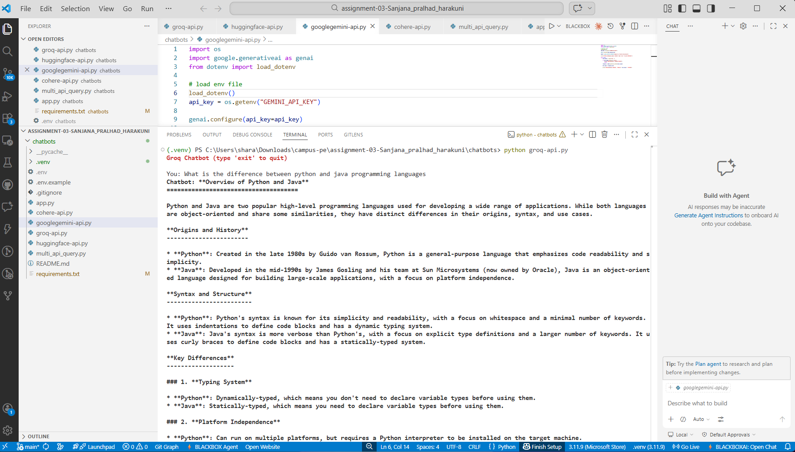
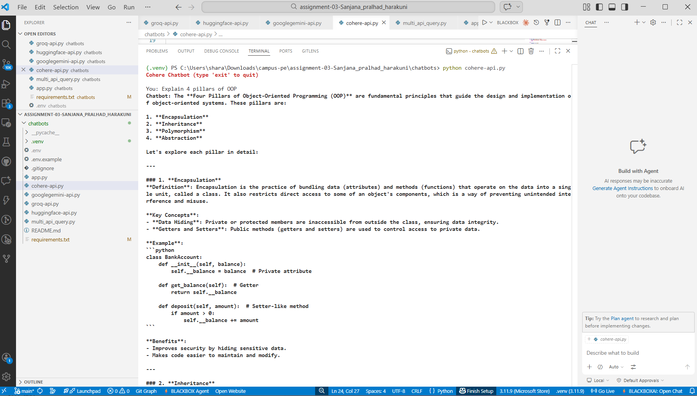
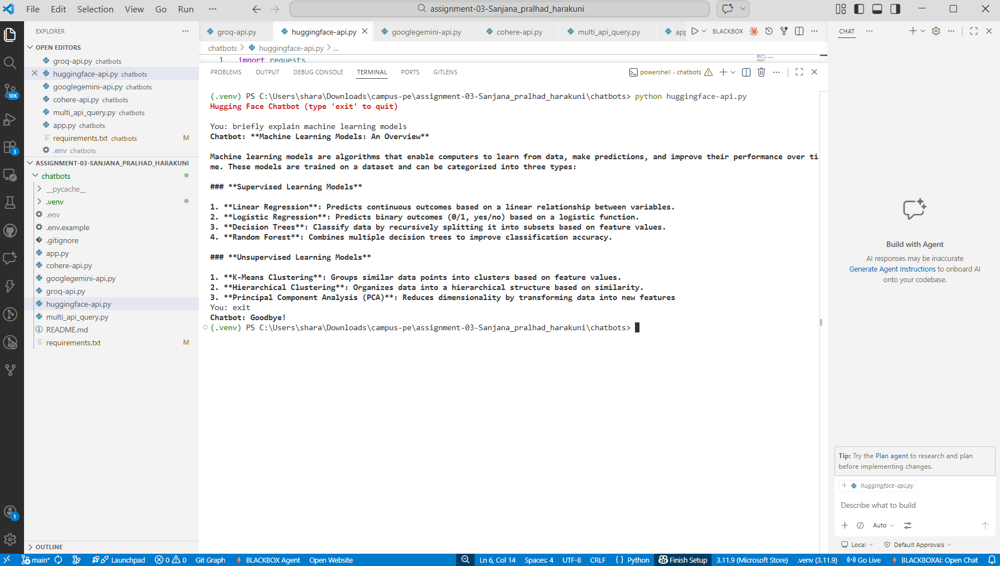
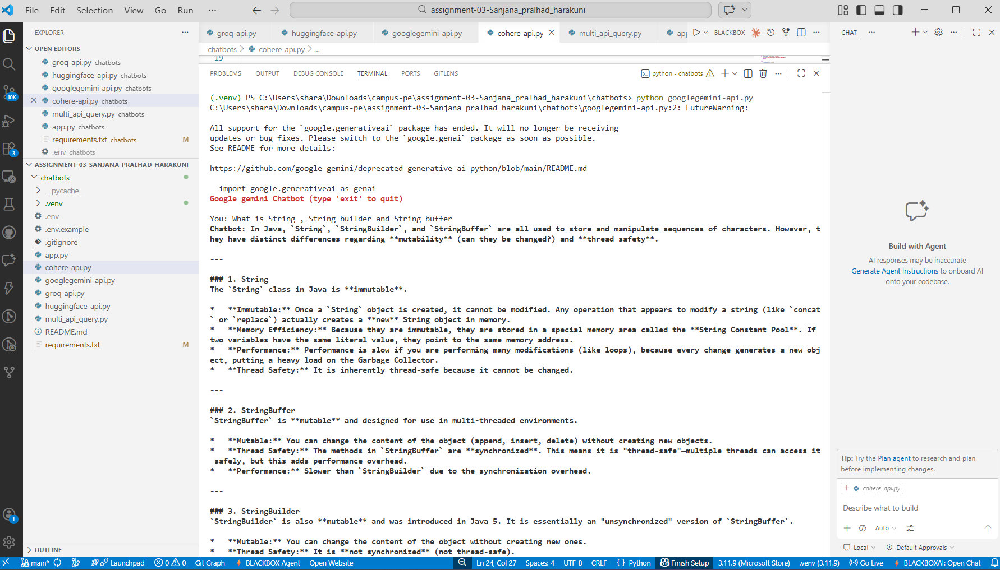
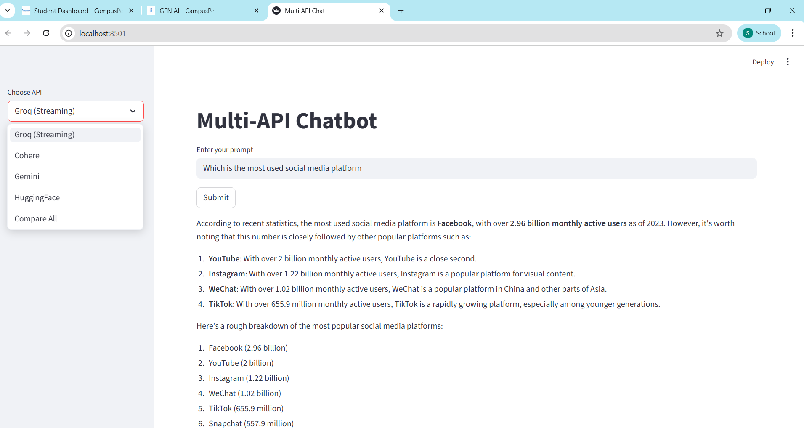

# **Assignment 03 Chatbots using API's**
---
## This Assignment contains terminal-based chatbots built using different AI APIs.
### APIs Used

1. Groq API  [Visit GitHub](groq-api.py)
2. Hugging Face API [Visit GitHub](huggingface-api.py)
3. Google Gemini API [Visit GitHub](googlegemini-api.py)
4. Cohere API [Visit GitHub](cohere-api.py)
   

---
## Project Structure
```
chatbots/
│
├── groq-api.py
├── huggingface-api.py
├── googlegemini-api.py
├── cohere-api.py
├── multi_api_query.py
│  
├── venv/
├── .gitignore
├── requirements.txt
├── .env.example
└── README.md
```
---

## How to Obtain API Keys
### Groq API Key
- Go to: https://console.groq.com
- Sign up / login
- Generate and Copy and save it securely

### Cohere API Key
- Go to: https://dashboard.cohere.com
- Create an account
- Generate and Copy and save it securely

### Google Gemini API Key
- Go to: https://makersuite.google.com
- Sign in with Google account
- Generate and Copy and save it securely

 ### Hugging Face Token
 - Visit: https://huggingface.co/settings/tokens
 - Sign in with Google account
 - Generate and Copy and save it securely

---
## Setup Instructions
### 1. Clone the Repository
- `git clone https://github.com/SANJANAHARAKUNI2003/Campuspe-assignment03.git`
- `cd chatbots`
---
## 2. Setup Environment Variables
### Create a `.env` file using `.env.example` and add your API keys.

Example:
- GROQ_API_KEY=your_key
- HF_API_KEY=your_key
- COHERE_API_KEY=your_key
- GEMINI_API_KEY=your_key

---
## 3. Install Dependencies 

1. Navigate to the chatbot folder: `cd campuspe-assignment03\chatbots`
2. Create virtual environment: `python -m venv venv`
3. Activate virtual environment
              - (Windows): `venv\Scripts\activate`
              - (Mac/linux): `source .venv/bin/activate`
4. Install dependencies: `pip install -r requirements.txt`
5. Run any api module
     - groq : `python groq-api.py`
     - cohere : `python cohere-api.py`
     - google gemini : `python googlegemini-api.py`
     - hugging face : `python huggingface-api.py`
     - multi apinchatbot : `streamlit run multi-api-query.py `


---
## Chatbot Screenshots
---
### Groq Chatbot



### Cohere Chatbot



### HuggingFace Chatbot



### Google gemini Chatbot




### Multi api Chatbot




